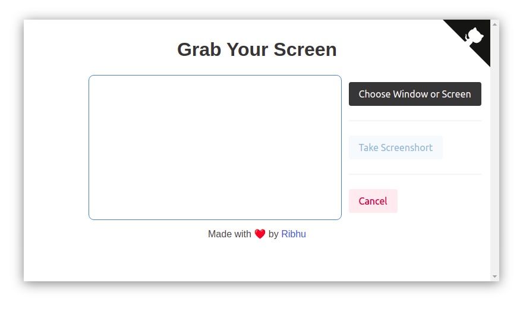
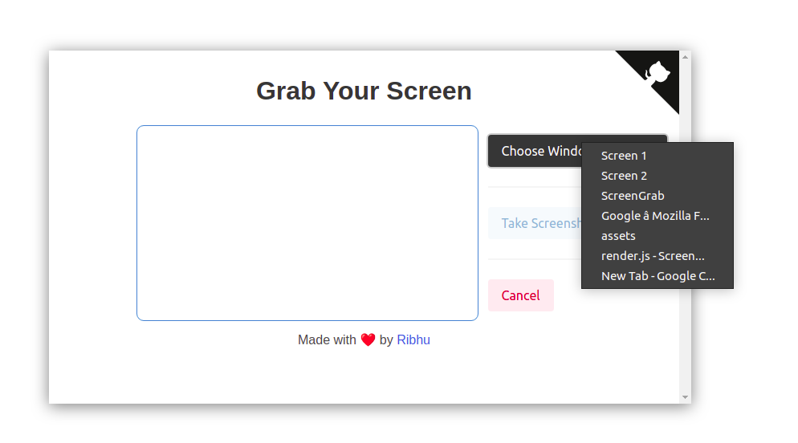
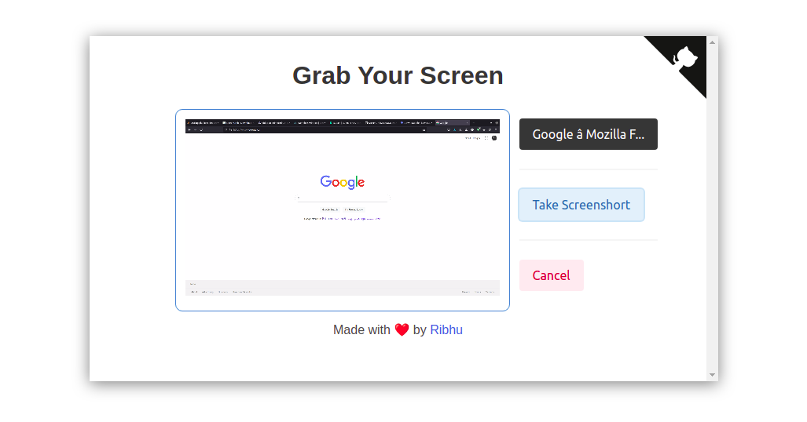

  #### Best Screenshot App for people with multiple Displays.
 </img>

#### The default Screenshot app in Ubuntu doesn't allow you to take screenshot of a whole screen at a time!

#### And my multidisplay setup forces me to keep using "Select Area to Grab" which is tedious.

#### here's the best way to take screenshot of whole displays in a single click: 👇🏽

Download the build for your platform from <a href="https://github.com/ribhuji/ScreenGrab/tree/main/builds" target="_blank">here</a>
- Open the App
 </img>
- Select your Screen or Window
 </img>
- Click on Take Screenshot
 </img>

